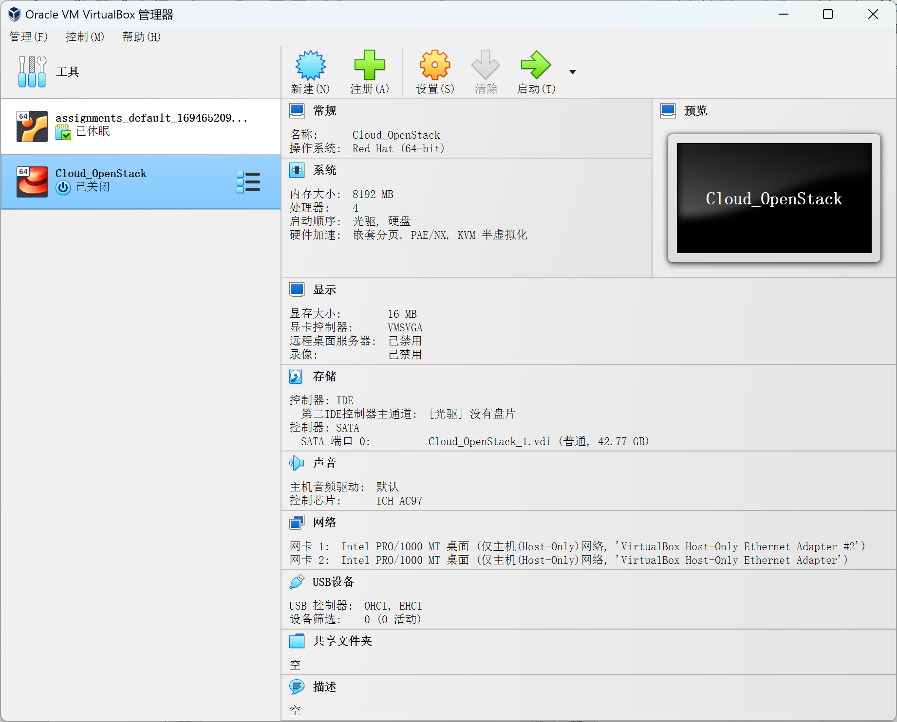
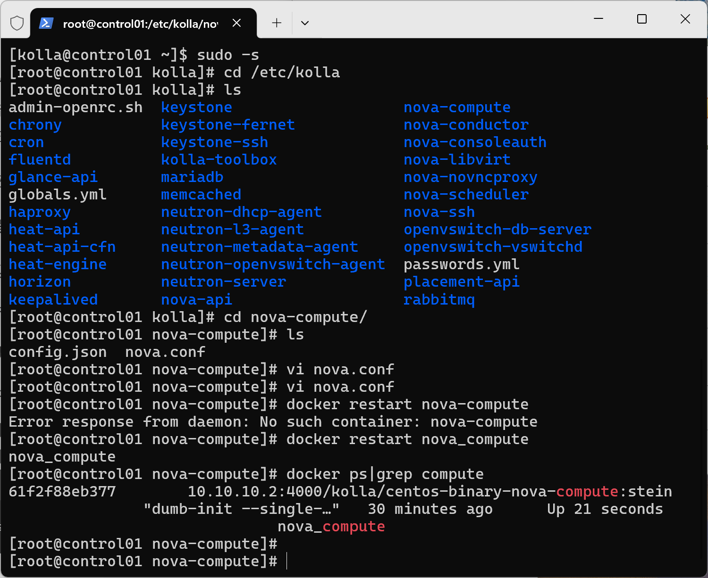
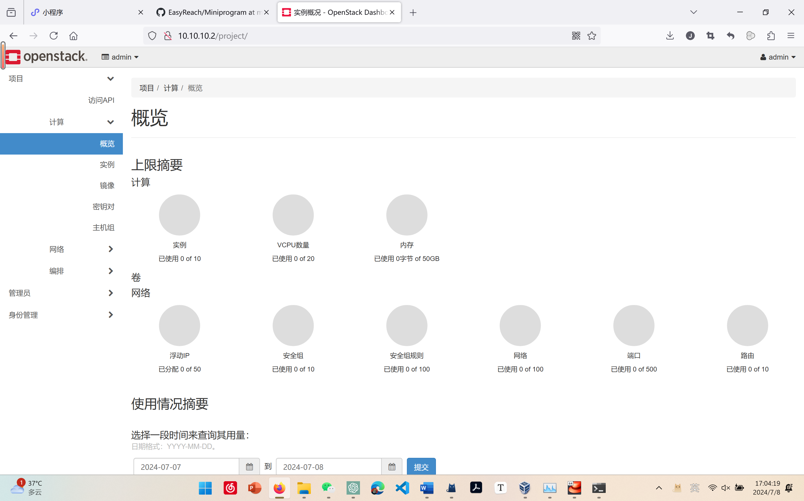
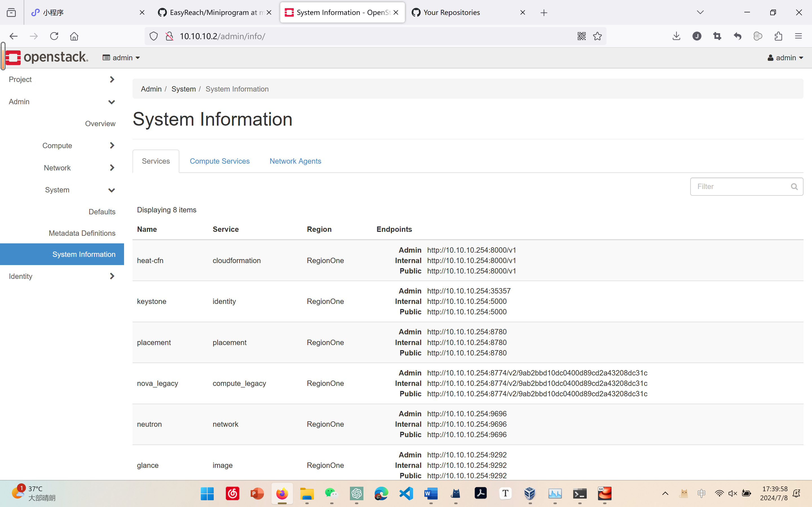
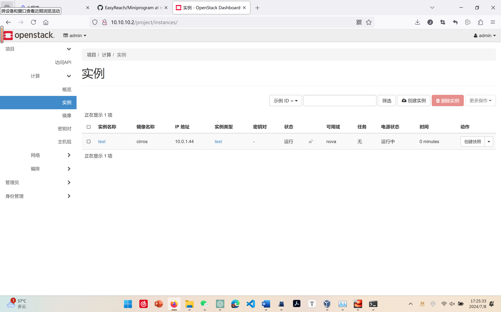

# Assignment 1

> *姓名：姜嘉祺*
> *学号：10225501447*

### 实验过程

#### 1. VirtualBox 中的虚拟机配置

##### 在 VirtualBox 中，我们配置了一个虚拟机，如下图。

#### 2. 安装并启动 OpenStack

##### 在配置好的虚拟机中，安装 OpenStack，并运行，查看服务是否启动成功。

在这部分遇到了一些问题，第一次配置虚拟机时，内存只分配了 2GB，导致在安装 OpenStack 时出现因内存不足而杀掉进程的问题。只能重新清理，并分配 8GB 内存进行重新安装，最后成功。

##### 最终截图如下。

#### 3. Powershell 登录后台

##### 在配置完成后，使用 Powershell 修改配置文件中字段为 `qemu` 并保存，最后查看 Docker 状态是否正常，如下图。

#### 4. 浏览器运行 Web 操作系统

##### 配置完成后，使用浏览器运行，初始界面截图如下。

##### 接着查看系统信息，截图如下。

##### 最后，创建实例并运行，截图如下。

