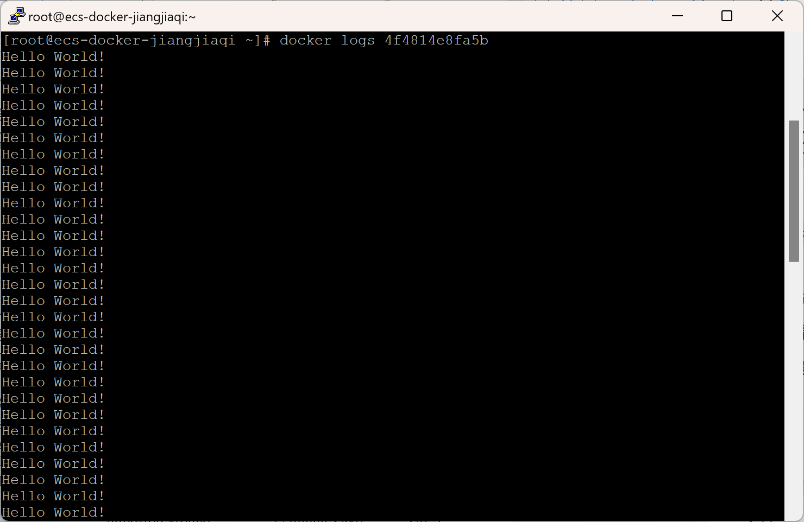
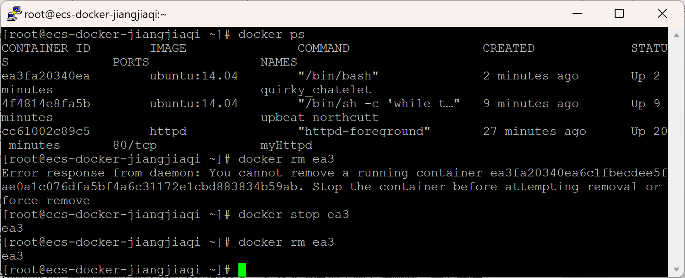
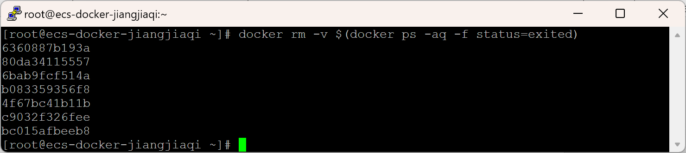

# Assignment 2

> *姓名：姜嘉祺*
> *学号：10225501447*

## 实验背景

### **1.1 实验介绍**

#### **1.1.1 关于实验**  
通过本次实验，完成 Docker 主机的安装和配置、镜像的搜索和下载、容器生命周期的基本管理、容器网络的管理。

#### **1.1.2 实验目的**  
1. 完成 Docker 的安装和配置。
2. 完成 Docker 镜像的基本操作。
3. 完成 Docker Hub 的基本操作。
4. 完成 Docker 容器的基本操作。

## 实验过程
### **1.2 购买实验资源**

#### **1.2.1 登录华为公有云**

   - 访问 [华为云](https://www.huaweicloud.com)，登录华为云账号。
   - *（省略了一些步骤）*

#### **1.2.2 创建虚拟私有云**

*（略）*

#### **1.2.3 创建并配置安全组**

*（略）*

#### **1.2.4 购买弹性云服务器**

- 购买完成后，返回控制台，稍等片刻，可以看到 ECS 状态为运行中，复制弹性 IP 地址
  

**配置 ECS 并安装 Docker**

1. 使用 PuTTY 连接ECS
   - 打开 PuTTY，输入弹性公网 IP 地址后，点击open
   - 用 root 用户名，和之前设置的密码登录 ECS

   

2. 检查内核版本
   ```sh
   uname -r
   ```

3. 移除旧的 Docker 版本
   ```sh
   yum remove docker docker-client docker-client-latest docker-common docker-latest docker-latest-logrotate docker-logrotate docker-selinux docker-engine-selinux docker-engine
   ```

4. 安装 Docker 依赖工具
   ```sh
   yum install -y device-mapper-persistent-data lvm2
   ```

### **1.3 Docker的安装和配置**

#### **1.3.1 Docker 的安装和配置**

1. 安装 Docker
   ```sh
   yum -y install docker
   ```

2. 启动 Docker 后台服务
   ```sh
   systemctl start docker
   ```

3. 测试运行 hello-world
   ```sh
   docker run hello-world
   ```
   
4. 查看下载的 hello-world 镜像

   ```bash
   docker images
   ```
   
   

### **1.4 镜像的基本操作**

####  **1.4.1 获取镜像**

#### **1.4.2 查询及删除镜像**

1. 查询镜像
   ```sh
   docker images
   ```

   

2. 查询部分镜像
   
   ```sh
   docker images ls nginx
   ```
   
   
   
3. 查看镜像大小
   ```sh
   docker system df
   ```

   
   
4. 删除镜像
   ```sh
   docker rmi [options] <image>
   ```
   
   
   
5. 删除已产生实例的镜像
   
   `-f`：强制删除，一般用于被占用
   
   

### **1.5 容器的基本操作**

#### **1.5.1 容器的创建与启停**

1. 创建一个基于 httpd 镜像的新容器
   ```sh
   docker create httpd
   ```

   
   
2. 查看容器
   ```sh
   docker ps -a
   ```
   
   

3. 启动容器
   ```sh
   docker start [容器ID]
   ```

   

4. 停止容器
   ```sh
   docker stop [容器ID]
   ```

   

5. 重启容器
   ```sh
   docker restart [容器ID]
   ```

   

6. 暂停容器
   ```sh
   docker pause [容器ID]
   ```

   

7. 恢复暂停的容器
   ```sh
   docker unpause [容器ID]
   ```

   

8. 强制停止容器
   ```sh
   docker kill [容器ID]
   ```

   

9. 给容器重新命名
   ```sh
   docker rename [容器ID] new-name
   ```

   

#### **1.5.2 容器的运行**

1. 运行新容器

   
   
2. 启动 bash 终端

   
   
3. 退出容器

   
   
4. 运行容器方式的比较

   
   
5. 获取容器输出信息

   

#### **1.5.3 进入容器**

1. 启动容器

   

2. 直接进入容器启动命令终端

   

3. 退出容器

   

4. 启动容器

   

5. 通过 docker exec 进入容器

   

6. 退出容器

   

#### **1.5.4 删除容器**

1. 删除处于终止状态的容器

   

2. 删除处于运行状态的容器

   

3. 删除所有终止容器

   

### **1.6 私有镜像仓库搭建**

#### **1.6.1 安装运行 Docker Registry**

1. 获取 Docker Registry 镜像并运行
   ```sh
   docker run -d -p 5000:5000 --name registry registry
   ```

   

2. 查看已有镜像
   ```sh
   docker images
   ```

   

3. 标记镜像
   ```sh
   docker tag <基础镜像名称：标签> 127.0.0.1:5000/<镜像名称>:<镜像标签>
   ```

   

4. 推送镜像
   ```sh
   docker push 127.0.0.1:5000/<镜像名称>:<镜像标签>
   ```

   

5. 查看仓库中的镜像
   ```sh
   curl 127.0.0.1:5000/v2/_catalog
   ```

   

6. 删除镜像并尝试下载
   ```sh
   docker image rm 127.0.0.1:5000/<镜像名称>:<镜像标签>
   docker pull 127.0.0.1:5000/<镜像名称>:<镜像标签>
   ```

## 实验总结

通过本次实验，掌握了 Docker 的基本操作，包括安装配置 Docker、镜像的管理、容器的生命周期管理等。