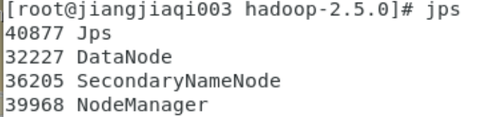

# Assignment 3

> *姓名：姜嘉祺*
> *学号：10225501447*

## 实验背景
Hadoop是一个开源的分布式计算平台，用于存储和处理大规模数据。它基于Google的MapReduce和Google File System的研究成果，提供了一个高效的分布式计算框架。Hadoop的核心组件包括Hadoop Common、Hadoop Distributed File System（HDFS）、Hadoop YARN和Hadoop MapReduce。

通过本次实验，旨在达到以下学习目标:
- 了解Hadoop的起源、发展和意义。
- 掌握Linux系统安装和虚拟机创建方法。
- 学会Hadoop三种运行模式的安装与配置。
- 理解MapReduce的执行原理并学会应用。

## 实验过程

### 1. 实验环境准备

#### 硬件配置
- CPU: 11th Gen Intel(R) Core(TM) i5-1135G7 @ 2.40GHz
- 内存: 16GB
- 硬盘: 512GB

#### 软件要求
- VMware虚拟机
- CentOS操作系统

### 2. Linux系统安装与配置

#### 2.1 安装Linux系统

1. 打开VMware虚拟机，选择文件 > 新建虚拟机 > 典型 > 下一步
2. 选择安装程序光盘映像文件，浏览并选择事先下载好的CentOS镜像文件。
3. 将虚拟机的名称改为`hadoop001`，并添加虚拟机安装的位置。
4. 选择默认设置。
5. 配置处理器个数1和每个处理器的核心数2。
6. 选择虚拟机内存大小2GB。
7. 选择网络类型。
8. 选择I/O控制器类型。
9. 创建新虚拟磁盘。
10. 选择虚拟磁盘大小。
11. 完成创建虚拟机。

此处截图1如下：

### 3. Hadoop搭建

#### 3.1 单例模式搭建

- 默认情况下，Hadoop即处于该模式，用于开发和调试。
- 不对配置文件进行修改。
- 使用本地文件系统，而不是分布式文件系统。

此处截图2如下：

#### 3.2 伪分布式模式搭建
- 修改配置文件: `core-site.xml`, `hdfs-site.xml`, `mapred-site.xml`, `yarn-site.xml`。
- 格式化文件系统。

此处截图3如下：

#### 3.3 集群模式部署
- 在所有主机上安装JDK和Hadoop，组成相互连通的网络。
- 在主机间设置SSH免密码登录。
- 修改配置文件: `core-site.xml`, `hdfs-site.xml`, `mapred-site.xml`, `yarn-site.xml`。
- 格式化文件系统。

此处截图4如下：

### 4. 集群时间同步

- 使用`ntp`服务进行时间同步。

### 5. MapReduce案例应用

#### 5.1 MapReduce简介

- MapReduce是一种分布式编程模型，用于处理大规模数据集。
- 适用于PB级别以上的海量数据处理。

#### 5.2 单词统计实例

- 功能: 统计文本文件中每个单词出现的次数。
- 过程:
  - **Split阶段**: 文件切分成多份。
  - **Map阶段**: 解析出每个单词，并在后边记上数字1。
  - **Shuffle阶段**: 将每一份中的单词分组到一起，并按字母排序。
  - **Reduce阶段**: 将相同的单词进行累加。
  - **输出结果**。

#### 5.3 MapReduce执行过程

- 数据会被切割成数据片段。
- 数据片段以key和value的形式被读取。
- 数据传入Map中进行处理。
- 输出的数据传给Shuffle完成排序和合并。
- 数据随后传给Reduce进行处理。
- Reduce处理完的数据会被写入HDFS。

#### 5.4 MapReduce实例 - 单词统计

- **Map阶段**:
  - 读取文件的每一行。
  - 对每行中的单词进行分割。
  - 为每个单词输出一个键值对<k, v>，其中k是单词，v通常是1。
- **Shuffle阶段**:
  - 对键值对进行排序。
  - 根据键进行分区。
  - 将相同键的键值对组合在一起。
- **Reduce阶段**:
  - 对每个键的键值对列表进行迭代。
  - 计算每个键的总和。
  - 输出键和总和。

## 实验总结

通过本次实验，不仅掌握了Hadoop的基本概念和架构，还学会了在Linux环境下安装和配置Hadoop的各种运行模式。此外，通过对MapReduce的深入理解，学会了如何编写简单的MapReduce程序来处理数据。